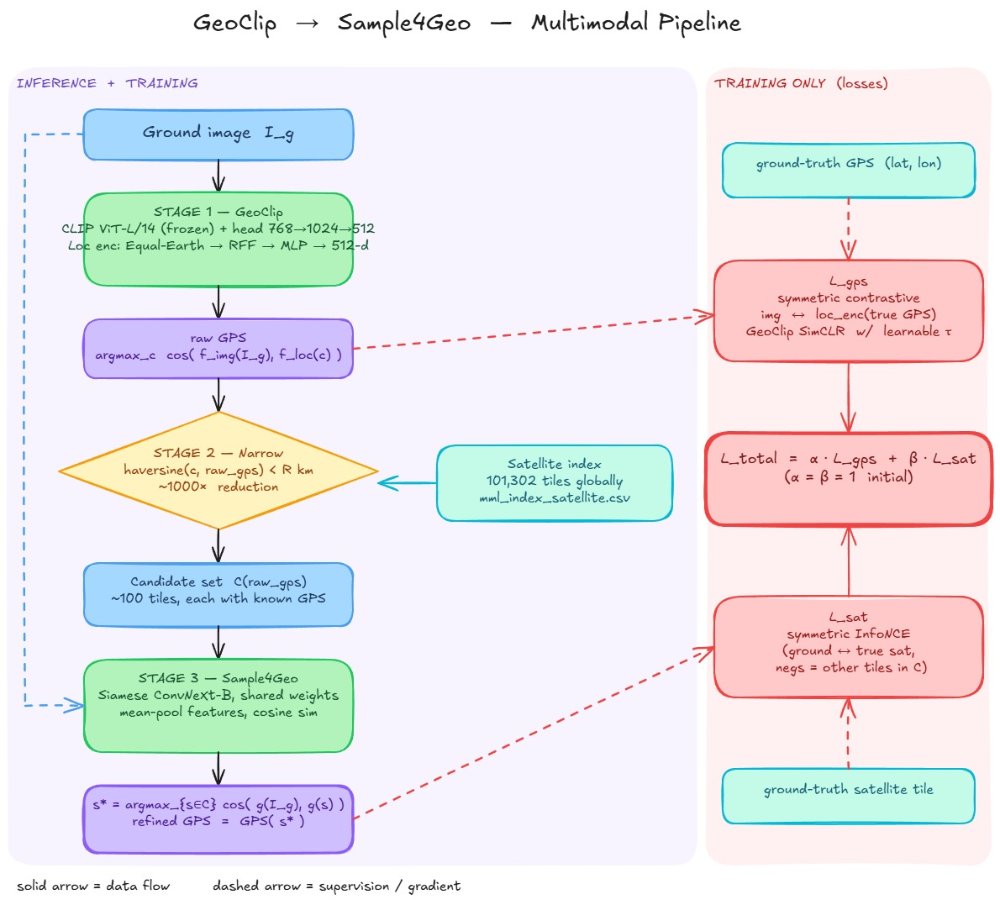

# Two-Stage Pipeline Design — GeoClip → Sample4Geo

## 1. Motivation

**Problem framing.** Given a ground-level photograph of a US landmark, predict its geographic location. The MMlandmarks dataset provides four modalities: ground photos, aerial (satellite) tiles, Wikipedia text, and GPS. Our current GeoClip baseline only uses ground + GPS.

**Why add satellite?** Cross-view retrieval papers ([Sample4Geo][s4g], TransGeo, University-1652) consistently show that ground↔satellite matching resolves location to tens of meters, whereas ground→GPS alone is typically accurate only to kilometers. Satellite imagery is the highest-resolution spatial prior we have that is not already leaked via GPS labels.

**Why stage it?** Running Sample4Geo globally (query × 101K satellite tiles) is O(N) per query. GeoClip gives us a cheap GPS prior that cuts N by ~1000× before the expensive cross-view comparison runs. The two models are complementary: GeoClip is *wide and coarse*, Sample4Geo is *narrow and fine*.

## 2. Pipeline

Four logical stages. Stages 1–3 run at both training and inference; stage 4 is training-only.

### Stage 1 — GeoClip (ground → raw GPS)
- Inputs: single ground image.
- Module: CLIP ViT-L/14 (frozen) + trainable 768→1024→512 head, plus GeoClip location encoder (Equal-Earth → RFF → hierarchical MLPs → 512-d).
- Output: `raw_gps = argmax_c  cos(img_emb, loc_emb(c))` over the gallery of training GPS points.
- Already implemented in [src/mmgeo/geolocalizations/geoclip/](../../src/mmgeo/geolocalizations/geoclip/).

### Stage 2 — GPS-based satellite narrowing
- Input: `raw_gps` from Stage 1, full satellite index (`mml_index_satellite.csv`, 101K rows).
- Output: candidate set of satellite tiles `C(raw_gps)` of size roughly 10²–10³.
- **Three narrowing strategies considered** (left open pending experimentation — see §5):

  | Strategy | How it works | Pros | Cons |
  |---|---|---|---|
  | **Hard radius (~100 km)** | Keep all tiles with haversine distance < R | Matches the sketch; trivially parallel; well-defined | Variable candidate count; if GeoClip error > R, true tile is excluded |
  | **Top-K nearest** | Keep K nearest tiles to `raw_gps` | Constant batch shape; simple to batch | Ignores local density; K must be tuned |
  | **Soft inverse-distance weighting** | Keep all tiles, weight by `exp(-d/σ)` | Differentiable end-to-end (gradient flows through narrowing back into GeoClip) | Heavy compute and memory; needs σ tuning |

  This step is what turns the 101K-tile problem into a ~100-tile problem — the "reduce satellite space" goal.

### Stage 3 — Sample4Geo (ground ↔ best satellite)
- Inputs: ground image, candidate set `C(raw_gps)`.
- Module: Siamese ConvNeXt-B with *shared* weights across views, symmetric InfoNCE loss, no polar transform or aggregation module (per [Sample4Geo][s4g] §3.2).
- Output: `pred_sat = argmax_{s∈C} cos(f(ground), f(s))` and its GPS (each satellite tile has known GPS from the index CSV).
- Hard-negative sampling during training (§3.3–3.4 of the paper): GPS-proximity neighbors early, then Dynamic Similarity Sampling (DSS) based on cosine similarity of embeddings. Our narrowing in Stage 2 is effectively a *query-conditional* hard-negative set — tiles near the predicted GPS are visually and geographically similar, which is exactly the regime DSS targets.

### Stage 4 — Joint loss (training only)
Two complementary signals:
- `L_gps` — GeoClip's existing symmetric contrastive loss between `img_emb` and `loc_emb(true_gps)`. Pushes ground image features toward the true GPS in the shared 512-d space.
- `L_sat` — Sample4Geo's symmetric InfoNCE loss between ground image and the ground-truth satellite tile for this landmark (positive) vs. other candidates in `C` (negatives).

Combined:  `L_total = α · L_gps + β · L_sat`

The two losses stay decoupled unless strategy (c) (soft weighting) is chosen — in which case the gradient of `L_sat` also flows into GeoClip via the narrowing weights, coupling the two stages.

## 3. Inference

1. Ground image → GeoClip → `raw_gps`.
2. Narrow satellite index to `C(raw_gps)` (≈100 tiles).
3. Sample4Geo scores each `(ground, c)` pair; pick top-1.
4. Refined prediction = GPS attached to the top-1 satellite tile.
   - Optional ensemble: weighted average of `raw_gps` and top-K satellite GPS values.

Evaluation reuses the existing haversine-threshold metrics (1, 25, 200, 750, 2500 km) from [src/mmgeo/geolocalizations/geoclip/evaluate.py](../../src/mmgeo/geolocalizations/geoclip/evaluate.py). We additionally expect recall@1 at the 100 m / 1 km scale to become meaningful for the first time.

## 4. How this addresses the two end goals

| Goal | Mechanism |
|---|---|
| **Shrink the satellite search space** | Stage 2 uses GeoClip's GPS prior to filter 101K tiles down to ~10² candidates per query — a 1000× reduction. Training Sample4Geo on this narrowed set is tractable; inference is trivially fast. |
| **Improve ground→GPS accuracy** | Stage 3 re-ranks candidates with a high-capacity visual matcher that sees satellite imagery directly. Since each satellite tile has known GPS, the final prediction inherits the tile's geolocation resolution (meters) rather than GeoClip's (kilometers). |

## 5. Open design questions

1. **Narrowing strategy** — which of hard-radius / top-K / soft-weighting performs best? Start with hard radius at 100 km (matches the sketch and the MMLandmarks claim of "within 100 m" being achievable after cross-view refinement); revisit if GeoClip error too often exceeds R.
2. **Training regime** — joint from scratch vs. staged (A: GeoClip fine-tune → B: Sample4Geo pretrain on ground↔satellite pairs → C: joint fine-tune)? Staged is safer and matches how both papers were individually trained.
3. **Loss weighting** — α, β. Default 1:1 then sweep.
4. **Satellite tile GPS granularity** — one landmark often has multiple satellite tiles; decide whether positives are *any-tile-of-this-landmark* (class-level) or *this-specific-tile* (instance-level). MMlandmarks is instance-level per its paper.
5. **Error propagation guard** — when GeoClip's prediction is very wrong, Stage 3 can never recover if R is tight. Consider a confidence-thresholded radius (large R when GeoClip is uncertain).

## 6. Pipeline diagram

Editable source: [Excalidraw link](https://excalidraw.com/#json=6qRY-0k3QTwo4Dn4wdex-,KVth8kEMTptbSrqdq14Q6g).

## 7. Current status and what would raise the grade

The sections above describe the *intended* pipeline. This section reconciles it with what is
actually in the repo today, and calls out the concrete items most likely to improve the final
grade given the project brief ([MultiModalGeolocalization.pdf](../../MultiModalGeolocalization.pdf)).

### 7.1 Where the code is today

| Stage | Status | Key files |
|---|---|---|
| 1. GeoCLIP ground → GPS | zero-shot evaluated; fine-tune scaffolded, metrics TBD | [src/mmgeo/geolocalizations/geoclip/](../../src/mmgeo/geolocalizations/geoclip/), [notebooks/team/04_geoclip_finetuned.ipynb](../../notebooks/team/04_geoclip_finetuned.ipynb) |
| 2. GPS-based satellite narrowing | **not implemented** | — |
| 3. Sample4Geo ground ↔ satellite | trained (ConvNeXt-B, 35 epochs) and evaluated standalone | [src/mmgeo/crossview/](../../src/mmgeo/crossview/), [configs/crossview_convnext_base.yaml](../../configs/crossview_convnext_base.yaml) |
| 4. Joint loss (α·L_gps + β·L_sat) | **not implemented** | — |
| Wikipedia text modality | **not implemented** | — |

### 7.2 Numbers on hand

- **GeoCLIP zero-shot** (paper protocol: 100k `mml_index_satellite.csv` gallery,
  18,688 query ground images; from `03_geoclip_zeroshot.ipynb` / [geoclip.md](./geoclip.md)):
  Acc@1km **6.67%**, @25km **28.79%**, @200km **44.48%**, @750km **69.07%**, @2500km **91.07%**;
  median error 294.3 km, mean 724.2 km. Sits ~14 points below the MML paper's 21.37% @1km
  on the same dataset/gallery — gap currently unexplained (email out to the first author).
  A 17,557 train-landmark gallery ablation scores 19.22% @1km but is inflated by cluster-luck
  (train and query landmarks co-locate in the same tourist cities) and is not comparable to
  the paper.
- **Sample4Geo standalone** (ConvNeXt-B, ep 35, `logs/crossview_base_28262514.out`):
  G2S R@1 **17.60%**, R@5 **33.00%**, R@10 **41.00%**, mAP@1000 **25.46%**; S2G R@1 5.30%.
- Fine-tuned GeoCLIP, two-stage combined, and any multimodal variant: **TBD**.

### 7.3 Gap relative to the brief

The brief explicitly asks for items we have not delivered yet:

- **Wikipedia text modality** — the brief lists "strategies for encoding Wikipedia text" as one
  of the two extensions. No code path touches landmark text today.
- **Baseline-vs-multimodal comparison** — each component has its own metrics, but no unified
  table compares them on the same query set with the same thresholds.
- **Benchmark transfer** — the brief asks how well the model adapts to other benchmarks
  (Uni-1652, or a held-out test set). Not attempted.
- **Written answers to the design questions** — "separate encoders?" and "which training
  objectives?" are posed in the brief but not argued in writing.

### 7.4 Priorities to raise the grade

Ordered roughly by impact ÷ effort.

1. **Close the pipeline end-to-end.** Implement Stage 2 with the default hard-radius
   strategy (§5 Q1) and run Stage 1 → Stage 2 → Stage 3 on the full query set
   (18,688 ground images across 1,000 landmarks). Until this exists the "multimodal
   pipeline" only lives in the design doc.
2. **Add the Wikipedia text modality.** Encode each landmark's text with the CLIP text
   encoder (already loaded). Simplest useful variant: late fusion — re-rank Sample4Geo's
   top-K by `cos(text_emb, image_emb)`. Stretch: early fusion at the GeoCLIP head.
   Directly answers the brief's text-encoding bullet with low incremental effort.
3. **Joint-loss training (Stage 4).** Once the pipeline is closed, run
   `L_total = α·L_gps + β·L_sat` end-to-end. Start α = β = 1 and sweep.
4. **One unified comparison table.** Same metrics (Acc@1/25/200/750/2500 km,
   median/mean error, R@1/5/10) across: zero-shot GeoCLIP · fine-tuned GeoCLIP ·
   Sample4Geo alone · two-stage · two-stage + text. This table *is* the brief's
   "evaluate and compare" deliverable.
5. **Benchmark transfer.** At minimum, evaluate the final model on a held-out
   MMLandmarks split not used during training. Stretch: Uni-1652.
6. **Ablations that justify the design choices.** Narrowing strategy (hard radius vs.
   top-K), α/β sweep, shared vs. separate text encoder. Each becomes one row in the
   comparison table and lets us argue the §5 open questions from evidence rather than
   intuition.
7. **Error analysis.** Haversine-error histogram on queries plus qualitative cases
   where Stage-1 error exceeds the radius, so Stage 3 can never recover. This
   motivates the confidence-thresholded radius proposed in §5 Q5.

## 8. References
- [sample4geo.pdf](../../papers/sample4geo.pdf) — Deuser et al., *Sample4Geo: Hard Negative Sampling For Cross-View Geo-Localisation*, ICCV 2023.
- [MultiModalGeolocalization.pdf](../../MultiModalGeolocalization.pdf) — Kristoffersen, project brief with the MMLandmarks task description.
- [src/mmgeo/geolocalizations/geoclip/](../../src/mmgeo/geolocalizations/geoclip/) — existing GeoClip baseline (dataset, lit_module, baseline, evaluate).

[s4g]: ../../papers/sample4geo.pdf
